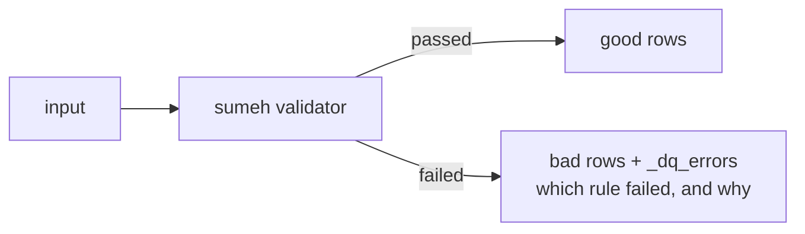

<h1 align="center"> Sumeh DQ</h1>

<p align="center">
  <a href="https://github.com/maltzsama/sumeh-dq/actions/workflows/ci.yml"></a>
  <a href="https://codecov.io/gh/maltzsama/sumeh-dq"></a>
  <a href="https://github.com/maltzsama/sumeh-dq/releases"></a>
  <a href="https://maltzsama.github.io/sumeh-dq/"></a>
  <a href="https://www.apache.org/licenses/LICENSE-2.0"></a>
  <a href="https://www.scala-lang.org"></a>
</p>

> **Data Quality for the modern data stack.** One rule engine, two execution backends — validate your Spark batches and your Flink streams with the same 50+ rule catalog.

Sumeh is a Scala data-quality library that runs the same declarative validation rules against **Apache Spark** (batch) and **Apache Flink** (streaming). It follows the **Bifurcation Pattern**: a single pass over your data tags every bad row, so you can split `(good, bad)` without reprocessing or shuffling.



---

## Highlights

- **50+ built-in rules** across 9 categories — completeness, uniqueness, comparison, membership, pattern, date, SQL, aggregation, and schema.
- **One rule catalog, two engines** — Spark batch and Flink streaming share the exact same `RuleDefinition` model.
- **Single-pass bifurcation** — bad rows are annotated in-flight with a `_dq_errors` struct; `split()` separates good from bad with **zero extra scans**.
- **Streaming honesty** — rules that can't run on an unbounded stream (uniqueness, table-level aggregation, custom SQL) are **skipped with a reason**, never silently passed.
- **Data profiler** — column-level statistics (nulls, distinct, min/max/mean/std/sum) in a single validation pass.
- **Multiple rule sources** — define rules in Scala, JSON, CSV, a Spark DataFrame, or a Flink Table.
- **Schema contracts** — validate column types, nullability, comments, and nested struct/array schemas.
- **Cross-built** for Scala `2.12` and `2.13`.

---

## Modules

| Module | Artifact | What it does |
|--------|----------|--------------|
| `core` | `sumeh-core` | Rule model, registry, loaders (JSON/CSV), validation model & report, schema models — **engine agnostic** |
| `spark` | `sumeh-spark-3.5` / `sumeh-spark-4.x` | `SparkValidator` — column-vectorized validation on `DataFrame`, zero `collect()` on row data. Artifact name carries the engine `major.minor` |
| `flink` | `sumeh-flink-1.20` / `sumeh-flink-2.x` | `FlinkValidator` — `DataStream[Row]` processing with side-output bifurcation. Artifact name carries the engine `major.minor` |

`core` has **no runtime dependencies** beyond `upickle` — it is pure data and logic.

### Supported matrix

Each engine artifact is compiled against the exact version in its name and published separately. The CI matrix exercises every engine version against the same source. The Spark floor is **3.5**, not 3.0: `DateExpr` relies on `try_to_timestamp`, which does not exist before Spark 3.5.

| Artifact | Compiled against | Scala |
|----------|------------------|-------|
| `sumeh-core` | — | 2.12, 2.13 |
| `sumeh-spark-3.5` | Spark 3.5.0 | 2.12, 2.13 |
| `sumeh-spark-4.0` | Spark 4.0.0 | 2.13 |
| `sumeh-spark-4.1` | Spark 4.1.0 | 2.13 |
| `sumeh-spark-4.2` | Spark 4.2.0 | 2.13 |
| `sumeh-flink-1.20` | Flink 1.20.0 | 2.12, 2.13 |
| `sumeh-flink-2.0` | Flink 2.0.0 | 2.12, 2.13 |
| `sumeh-flink-2.1` | Flink 2.1.0 | 2.12, 2.13 |
| `sumeh-flink-2.2` | Flink 2.2.0 | 2.12, 2.13 |
| `sumeh-flink-2.3` | Flink 2.3.0 | 2.12, 2.13 |

Pick the artifact matching your engine version. Since the Spark 4.x line only ships Scala 2.13, the `sumeh-spark-4.x` artifacts are 2.13-only; the 3.5 and Flink lines are cross-built for both Scala versions.

---

## Installing

Artifacts are published to **GitHub Packages** (`https://maven.pkg.github.com/maltzsama/sumeh-dq`). Version numbers follow the release tags (`v0.1.0` → `0.1.0`).

### sbt

```scala
resolvers += "GitHub Packages" at "https://maven.pkg.github.com/maltzsama/sumeh-dq"

libraryDependencies ++= Seq(
  "io.galileostd" %% "sumeh-core"        % "0.1.0",
  // pick the artifact matching your engine version:
  "io.galileostd" %% "sumeh-spark-3.5"   % "0.1.0", // Spark 3.5
  "io.galileostd" %% "sumeh-spark-4.0"   % "0.1.0", // Spark 4.0
  "io.galileostd" %% "sumeh-spark-4.1"   % "0.1.0", // Spark 4.1
  "io.galileostd" %% "sumeh-spark-4.2"   % "0.1.0", // Spark 4.2
  "io.galileostd" %% "sumeh-flink-1.20"  % "0.1.0", // Flink 1.20
  "io.galileostd" %% "sumeh-flink-2.0"   % "0.1.0", // Flink 2.0
  "io.galileostd" %% "sumeh-flink-2.1"   % "0.1.0", // Flink 2.1
  "io.galileostd" %% "sumeh-flink-2.2"   % "0.1.0", // Flink 2.2
  "io.galileostd" %% "sumeh-flink-2.3"   % "0.1.0"  // Flink 2.3
)
```

Private repos (or any repo) require credentials to resolve:

```scala
credentials += Credentials(
  "GitHub Package Registry",
  "maven.pkg.github.com",
  "<your-github-username>",
  "<personal-access-token>"
)
```

### Maven

```xml
<repositories>
  <repository>
    <id>github</id>
    <url>https://maven.pkg.github.com/maltzsama/sumeh-dq</url>
  </repository>
</repositories>

<dependency>
  <groupId>io.galileostd</groupId>
  <artifactId>sumeh-core_2.13</artifactId>
  <version>0.1.0</version>
</dependency>
```

---

## Quick Start

### 1. Spark (batch)

```scala
import io.galileostd.sumeh.rule.{ RuleDefinition, ListValue, LongValue, StringValue }
import io.galileostd.sumeh.spark.SparkValidator

// Define rules programmatically (checked against the registry at build time)
val rules = Seq(
  RuleDefinition.validated(Left("email"),  "is_complete"),
  RuleDefinition.validated(Left("age"),     "is_between", value = Some(ListValue(List(LongValue(18), LongValue(65))))),
  RuleDefinition.validated(Left("status"),  "is_contained_in",
    value = Some(ListValue(List(StringValue("active"), StringValue("pending"))))),
  RuleDefinition.validated(Left("revenue"), "is_positive")
)

// One pass. Adds a `_dq_errors` column, returns a report.
val report = SparkValidator.validate(df, rules)

// Bifurcation — good vs. bad, no reprocessing.
val (good, bad) = report.split()
good.write.mode("overwrite").parquet("s3://bucket/good/")
bad .write.mode("overwrite").parquet("s3://bucket/bad/")

// Summary for dashboards / sinks / Deletron-style alerting.
val summary: Map[String, Any] = report.summary()
println(report.passRate) // fraction of evaluated rules that passed (skipped excluded)
```

`report.summary()` produces a `Map` you can drop straight into a sink or metrics endpoint:

```json
{
  "engine": "spark",
  "total_rows": 5,
  "passed": 2,
  "failed": 1,
  "errors": 0,
  "skipped": 1,
  "pass_rate": 0.667,
  "validations": [ { "check_type": "is_complete", "status": "PASS", "pass_rate": 1.0, "...": "..." } ]
}
```

### 2. Flink (streaming)

```scala
import io.galileostd.sumeh.rule.{ RuleDefinition, StringValue }
import io.galileostd.sumeh.flink.FlinkValidator

val rules = Seq(
  RuleDefinition.validated(Left("name"), "is_complete"),
  RuleDefinition.validated(Left("amount"), "is_positive"),
  RuleDefinition.validated(Left("dt"), "validate_date_format", value = Some(StringValue("yyyy-MM-dd")))
)

val validated = FlinkValidator.validate(stream, rules)        // DataStream[Row]
val (good, bad) = validated.split()                            // side outputs, zero reprocessing
good.map(...).sinkTo(goodSink)
bad .map(...).sinkTo(badSink)
```

Streaming is **stateless by design**: each row is evaluated independently. Stateful/TABLE rules are reported as `SKIPPED` with a reason instead of failing the pipeline.

---

## Defining Rules

### Programmatic

`RuleDefinition.validated(field, checkType, value?, threshold?, execute?, metadata?)` validates the rule against `RuleRegistry` and enriches `level`/`category` automatically. An unknown check type throws immediately.

`field` is `Left("col")` for a single column or `Right(List("a", "b"))` for multi-column rules (`are_complete`, `are_unique`, ...).

### JSON

```json
[
  { "field": "email",  "check_type": "is_complete" },
  { "field": "age",    "check_type": "is_between",  "value": [18, 65] },
  { "field": "status", "check_type": "is_in",       "value": ["active", "pending"] }
]
```

```scala
import io.galileostd.sumeh.config.RuleLoader
val rules = RuleLoader.fromJsonString(json)   // List[RuleDefinition]
val back  = RuleLoader.toJson(rules)          // round-trip to JSON
```

### CSV

```csv
field,check_type,value,threshold,execute,level,category
email,is_complete,,1.0,true,ROW,completeness
age,is_between,"ListValue([LongValue(18),LongValue(65)])",1.0,true,ROW,comparison
```

`RuleLoader.fromCsvString(csv)` / `toCsv(rules)` — values use a lossless tagged format that round-trips through the `RuleValue` ADT.

### From a Spark DataFrame

```scala
import io.galileostd.sumeh.spark.config.SparkRuleLoader
val rules = SparkRuleLoader.fromDataFrame(rulesDf)                 // columns: field, check_type, ...
val rules = SparkRuleLoader.fromJsonColumn(rulesDf, "config")      // one JSON rule per row
```

### From a Flink Table

```scala
import io.galileostd.sumeh.flink.config.FlinkRuleLoader
val rules = FlinkRuleLoader.fromTable(rulesTable)
val rules = FlinkRuleLoader.fromJsonColumn(rulesTable, "config", tableEnv)
val rules = FlinkRuleLoader.fromTableResult(result, fieldNames)
```

---

## Validation Model

A validation run produces a `ValidationReport`:

| Status | Meaning |
|--------|---------|
| `PASS` | The metric satisfied the rule expectation |
| `FAIL` | The metric violated the rule |
| `ERROR` | The rule could not be evaluated (unknown field, invalid config, runtime error) |
| `SKIPPED` | The rule was intentionally not executed — `execute=false`, wrong level, or engine doesn't support it (e.g. uniqueness in Flink streaming) — **with a reason** |

- `report.passed / failed / errors / skipped` — bucket results by status.
- `report.passRate` — passed ÷ evaluated (**skipped excluded**); `1.0` when nothing is evaluated.
- `report.summary()` — flat JSON-friendly map with per-rule status, pass rate, and fail count. Ready to drop into a sink or metrics endpoint.
- `report.split()` — the Bifurcation: `(good, bad)` via the engine's `Splittable`.

### Row-level vs. Table-level

| Level | Meaning | Spark | Flink streaming |
|-------|---------|-------|-----------------|
| `ROW` | Per-row checks (`is_complete`, `is_positive`, `validate_date_format`, ...) | ✅ annotated in `_dq_errors` | ✅ evaluated per record |
| `TABLE` | Aggregations (`has_mean`, `has_sum`, `has_cardinality`, `validate_schema`) | ✅ | ❌ skipped with reason |

---

## Schema Contracts

Beyond value rules, Sumeh validates the shape of your data:

```scala
import io.galileostd.sumeh.schema.{ SchemaDef, ColumnDef }
import io.galileostd.sumeh.spark.schema.SparkSchemaValidator

val contract = SchemaDef(
  columns = List(
    ColumnDef("id", "integer", nullable = false, requireComment = true),
    ColumnDef("name", "string"),
    ColumnDef("tags", "array", elementType = Some("string")),
    ColumnDef("address", "struct", fields = Some(List(
      ColumnDef("street", "string"),
      ColumnDef("zip", "integer")
    )))
  ),
  strictColumns = true  // extra columns in the data become errors
)

val report = SparkSchemaValidator.validate(df, contract)
report.passed         // Boolean
report.typeErrors     // col -> "Expected X, got Y"
report.missingCols    // required columns that are absent
report.metadataErrors // comment / nullability violations
report.extraCols      // only when strictColumns = true
```

Or declare the contract in a `Map`:

```scala
val contract = SchemaDef.fromMap(Map(
  "id"     -> Map("type" -> "integer", "nullable" -> false, "require_comment" -> true),
  "name"   -> "string",
  "tags"   -> Map("type" -> "array", "element_type" -> "string"),
  "address" -> Map(
    "type"   -> "struct",
    "fields" -> Map("street" -> "string", "zip" -> "integer")
  )
), strict = true)
```

Run it as a rule too: `RuleDefinition.validated(Left("_schema"), "validate_schema")`.

---

## Data Profiling

Get column-level statistics without writing any validation rules — every column and statistic is computed in a single aggregation, independent of table width.

```scala
import io.galileostd.sumeh.spark.SparkProfiler

val profile = SparkProfiler.profile(df)                    // ProfileReport
val profile = SparkProfiler.profile(df, sampleFraction = Some(0.1)) // sampled

profile.columnProfiles("revenue").mean      // Option[Double]
profile.columnProfiles("email").distinctCount
profile.tableStats                           // Map(total_rows, columns_count, execution_time_ms)
profile.toJson                               // JSON payload for dashboards / metrics
```

For every column it measures completeness and cardinality; numeric columns additionally get `min`, `max`, `mean`, `std_dev`, and `sum`. Output mirrors the Python `profile()` structure: `{ "table_stats": {...}, "column_profiles": { col -> {...} } }`.

---

## Rule Catalog

| Category | Rules |
|----------|-------|
| **completeness** | `is_complete`, `are_complete` |
| **uniqueness** | `is_unique`, `are_unique`, `is_primary_key`¹, `is_composite_key`¹ |
| **comparison** | `is_equal`, `is_equal_than`, `is_between`, `is_greater_than`, `is_less_than`, `is_greater_or_equal_than`, `is_less_or_equal_than`, `is_positive`, `is_negative`, `is_in_millions`, `is_in_billions` |
| **membership** | `is_contained_in`, `not_contained_in`, `is_in`¹, `not_in`¹ |
| **pattern** | `has_pattern`, `is_legit` |
| **date** | `is_today`, `is_t_minus_1`, `is_t_minus_2`, `is_t_minus_3`, `is_yesterday`¹, `is_past_date`, `is_future_date`, `is_date_between`, `is_date_after`, `is_date_before`, `is_on_weekday`, `is_on_weekend`, `is_on_monday`…`is_on_sunday`, `validate_date_format`, `all_date_checks` |
| **sql** | `satisfies` |
| **aggregation** | `has_min`, `has_max`, `has_sum`, `has_mean`, `has_std`, `has_cardinality`, `has_entropy`, `has_infogain` |
| **schema** | `validate_schema` |

¹ alias of another rule.

- **Aliases** resolve to their target (`is_in` → `is_contained_in`, `is_primary_key` → `is_unique`, ...).
- **Engine support** is enforced: `RuleRegistry.isSupported(checkType, engine)` is `false` for uniqueness rules (`is_unique`, `are_unique`, `is_primary_key`, `is_composite_key`) everywhere except **Spark batch**, for `satisfies` in any streaming engine (`spark-streaming`, `flink-streaming`), and for TABLE-level rules in any streaming engine.
- **`has_entropy`** is the Shannon entropy `-Σ pᵢ·log₂(pᵢ)` of the value distribution; **`has_infogain`** is the normalized entropy `H / log₂(cardinality)` (1.0 = uniform, 0.0 = single value). Both are TABLE-level, batch-only, and compare against `value` within the relative `threshold`.
- `RuleRegistry.listRules()`, `.byCategory(...)`, `.byLevel(...)`, `.getRule(...)` let you introspect the catalog at runtime.

---

## Project Layout

```text
sumeh/
├── core/       # RuleDefinition, RuleRegistry, RuleLoader (JSON/CSV), ValidationReport,
│               # ValidationStatus, SchemaModels, MetricResult — no engine deps
├── spark/      # SparkValidator, SparkAnalyzer, SparkConstraint, SparkRuleLoader,
│               # SparkSchemaValidator, ValidatedSparkDataFrame
├── flink/      # FlinkValidator, DQProcessFunction, FlinkRuleLoader, ValidatedFlinkStream
├── project/    # sbt build
├── .github/    # CI (cross-build on Java 17, Scala 2.12 + 2.13)
└── build.sbt
```

---

## Building & Testing

Requirements: **JDK 17+**, **sbt 1.11+**.

```bash
# Full test suite (Scala 2.13, default Spark 3.5.0 / Flink 1.20.0)
sbt test

# Cross-build tests
sbt -batch "++2.13.16" "test"
sbt -batch "++2.12.18" "core/test" "flink/test"

# Spark floor under Scala 2.12
sbt -batch -Dspark.version=3.5.0 "++2.12.18" "spark/compile"

# Flink floor
sbt -batch -Dflink.version=1.20.0 "flink/test"

# Statement coverage for all modules (core gate >= 90%) + aggregate report
sbt -batch "coverage" "test" "coverageAggregate" "coverageReport"

# Formatting
sbt scalafmtAll scalafmtCheckAll
```

**Engine floors:** each engine artifact is compiled against the exact version in its name — `sumeh-spark-3.5` against Spark 3.5.0, `sumeh-spark-4.1` against 4.1.0, `sumeh-flink-2.2` against Flink 2.2.0, and so on. The Spark floor is **3.5**, not 3.0: `DateExpr` relies on `try_to_timestamp`, which does not exist before Spark 3.5. The CI matrix exercises Spark 3.5.0 / 4.0.0 / 4.1.0 / 4.2.0 and Flink 1.20.0 / 2.0.0 / 2.1.0 / 2.2.0 / 2.3.0, and every published artifact is compiled against the version it is tested against.

---

## Design Principles

1. **No silent passes.** If a rule can't run, it is `SKIPPED` with a reason — never counted as a pass.
2. **Pure config layer.** `RuleLoader` only parses; you bring your own storage (S3, GCS, DBFS, JDBC, HTTP, ...).
3. **Streaming without surprises.** Flink validation is stateless per record; anything that needs state is flagged, not faked.
4. **Bifurcation first.** Bad rows are annotated in a single pass, so the split into `(good, bad)` is free.

---

## License

Apache 2.0.
